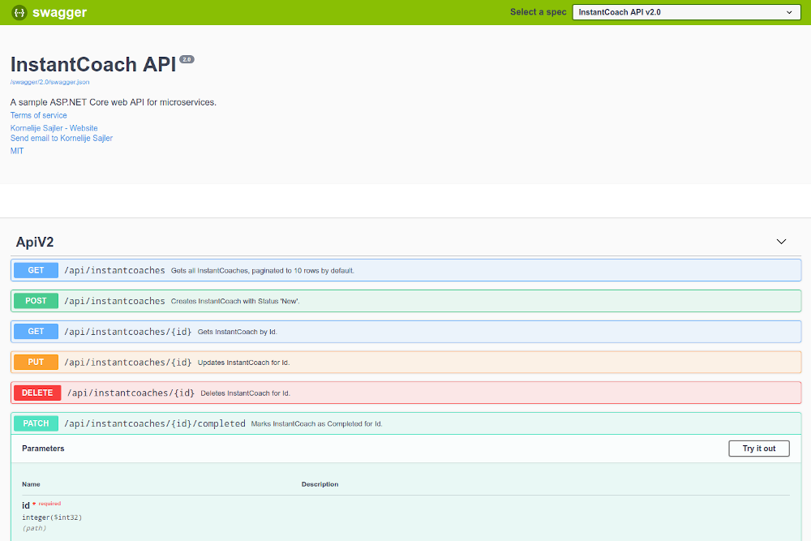
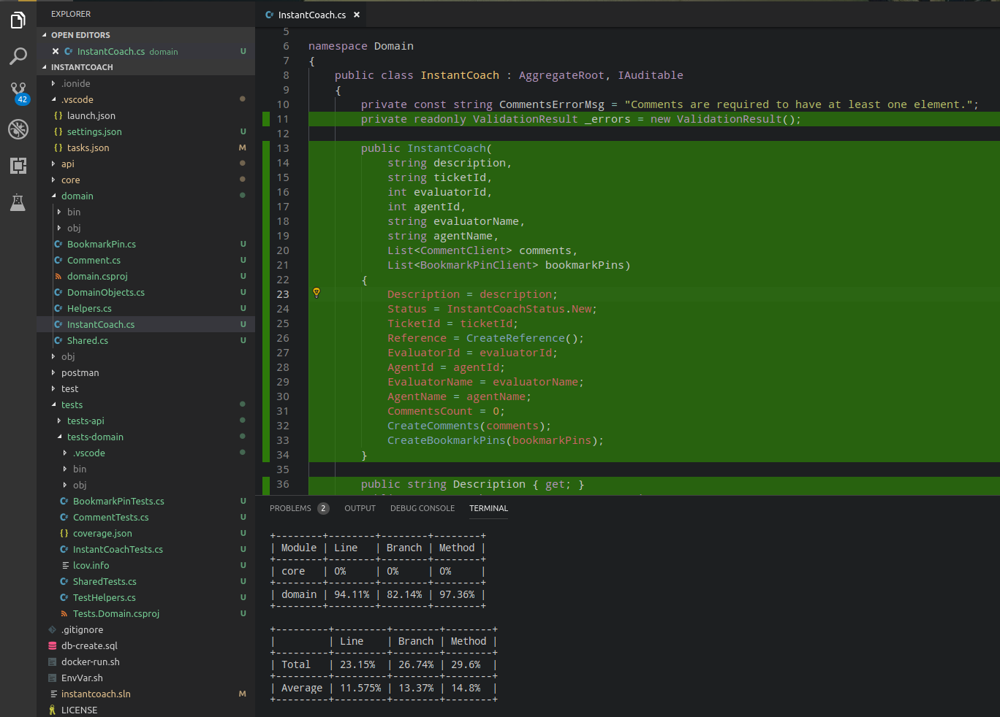
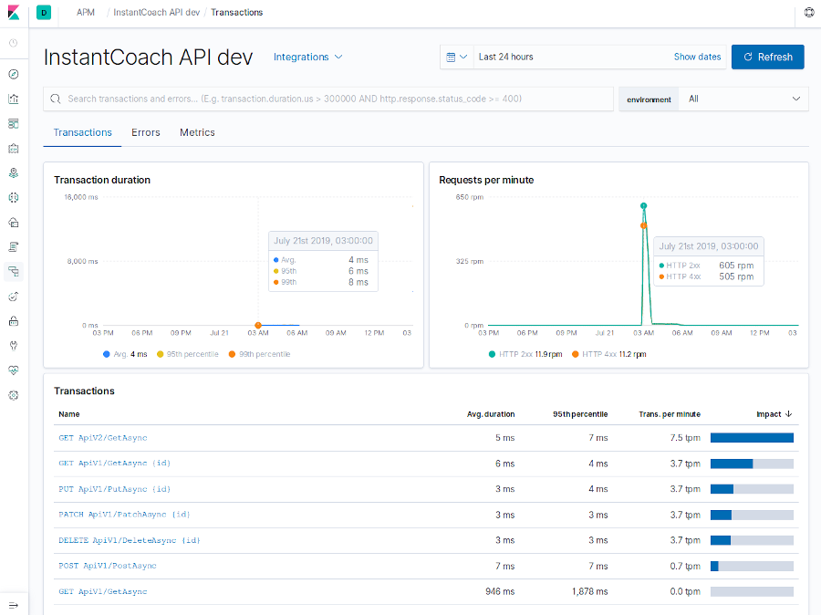
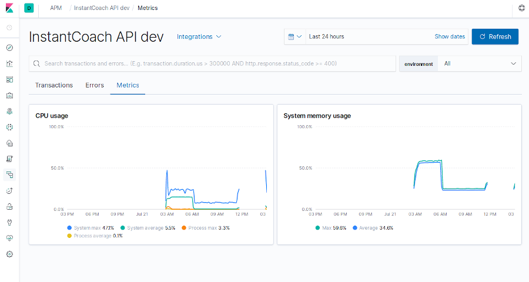
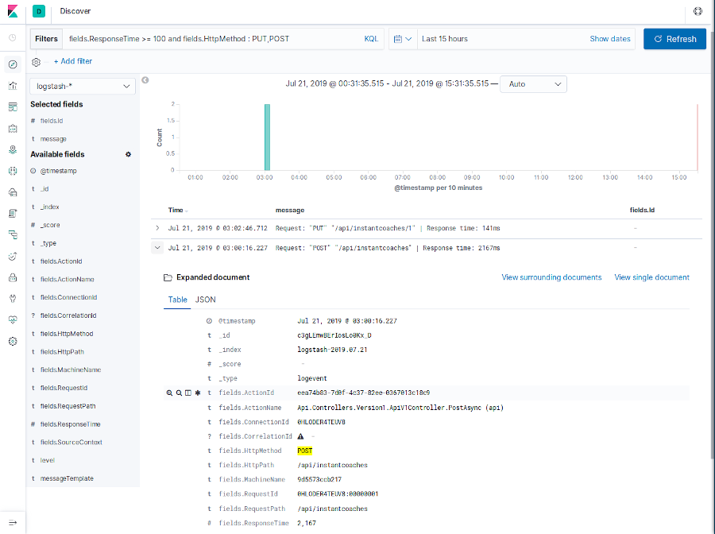

# InstantCoach API


[](https://travis-ci.org/xajler/instantcoach-api)
[](https://coveralls.io/github/xajler/instantcoach-api?branch=master)

Using ASP.NET Core API for sample microservices REST API.




Unit testing with code coverage in VS Code



Domain Errors and Endpoint Request Logging


> Note:
>
> Most of C# files contain multiple classes, because of microservices nature, if this wouldn't be microservice, those would go to folders and separate files.

Created using:

* Linux (ArchLinux)
* .NET Core 2.2 (Local and Docker)
* C#7
* EF Core (Commands) / ADO.NET via EF Core (Queries)
* SQL Server 2017 (Docker)
* Nginx (Docker)
* VS Code (With C# Extensions)
* Azure Data Studio (Local GUI for SQL Server)
* Unit Testing (xUnit, FluentAssertions, Coverlet, Moq)

## Features

* [x] EF Migrations (Will update to last migration or create database in `Startup`)
* [x] Config through `IOptions<T>`
* [x] Linux MSSQL in Docker
* [x] API Versioning (Dummy v2 inherited from v1, HTTP Header versioning `X-Api-Version`)
* [x] REST API Endpoint (multiple versions, JWT Auth)
* [x] Swagger (multiple versions, JWT Auth)
* [x] Db CRUD / Service (to make Controller cleaner)
* [x] JWT Auth
* [x] Error Handling (Known Errors as `Result` and `Result<T>`, Global Exception through Middleware)
* [x] Logging (`Serilog` console and sink to ElasticSearch)
* [x] Request response time Middleware (including adding response time in ms in logs and response header as `X-Response-Time`)
* [x] Domain Models Validation
* [x] Unit Testing (Domain)
* [x] Refactoring (Domain to DDD and separate project)
* [x] Integration Testing (Repositories and Controllers V1)
* [x] Code Coverage (_coverlet_)
* [x] Dockerfile Build/Publish/Run API
* [x] Dockerfile Nginx web server with SSL nginx.conf (Not really necessary because this REST API should be internal/private)
* [x] Docker Compose (Development with watch, Test, CI Testing)
* [x] SSL (local development: dotnet dev-certs https, test: nginx self-signed certificate)
* [x] Github badges for Code Coverage (coveralls.io) and CI (Travis CI) (master branch)
* [x] Integrated Elasticsearch APM (Application Performance Monitoring)
* [x] Integrated Elasticsearch LogStash through Kibana.
* [] Unit Testing - Mock Services, problem Repository is not interface?
* [] xUnit Categories for focused testing.
* [] Redis cache Docker or Nginx
* [] Health checks
* [] Apiary
* [] Domain validation: Maybe use `FluentValidation` and send errors (merge with DataAnnotations ones) in Controller.
* [] CD Azure (? only one I have access to deploy)

## TODO for separate projects

* [] GraphQL (? maybe separate project)
* [] Message Queue (? maybe separate project)
* [] CQRS (? maybe separate project)
* [] Storyteller tests (?)

## Run

Scripts created are compatible with _Unix_ like operating systems (_Linux_, _BSD_, _macOS_). It won't work on _Windows_, but it should be easy to use command in there to run in _Windows_.

Make sure that Docker is installed and service is running, on most Linux machines it is achievable with `systemd` command:

```ssh
sudo systemctl start docker.service
# or you can enable it, so it will be started when OS is booted
sudo systemctl enable docker.service
```

For other operating systems do according way of starting/enabling docker service.

### Local Dev

Runs with locally installed _.NET Core SDK_. Uses only _MSSQL_ as a _Docker_ container.

Find out more how to run [Local Dev](_docs/local-dev-env.md).

Short version:

```shell
docker pull microsoft/mssql-server-linux
./docker-mssql-run.sh
./run-local.sh
```

### Docker Dev

Runs all services as _docker_ containers, but with mounted _docker volumes_ to code repository and _https certificate_. Has `ASPNETCORE_ENVIRONMENT` set to `Development`, and uses _APM Server_ with _ElasticSearch LogStash_ as main development driver

Find out more how to run [Docker Dev](_docs/docker-dev-env.md).

Short version:

```shell
docker pull microsoft/mssql-server-linux
./docker-mssql-run.sh
./run-local.sh
```


### Docker Testing/Production

Similar to [Docker Dev](_docs/docker-dev-env.md) but not sharing local machine folder(s) as docker container volumes. Everything runs inside of docker containers.

TODO: More to add.

## Unit/Integration Testing

### Local

Make sure _MSSQL_ runs for Integration tests.

#### All Tests

Best to run script:

```shell
# Change DB_HOST, if your DB host different than localhost
DB_HOST=localhost ./run-code-coverage.sh
```

Runs all tests and at the end generates code coverage report, more info in _Local Code Coverage Report_ section.

#### Unit Tests

Best to run test with watcher, so any time change to file is saved it will restart all unit tests.

```shell
cd tests/tests-unit
dotnet watch test
```

It can show code coverage when all tests ran successfully with this command:

```shell
dotnet watch test /p:CollectCoverage=true /p:CoverletOutputFormat=cobertura /p:CoverletOutput=./coverage.xml
```

#### Integration Test

For Integration tests it is not recommended to use `dotnet watch`.

```shell
cd tests/tests-integration
# Change DB_HOST, if your DB host different than localhost
DB_HOST=localhost dotnet test
```

It can show code coverage when all tests ran successfully with this command:

```shell
DB_HOST=localhost
dotnet watch test /p:CollectCoverage=true /p:CoverletOutputFormat=cobertura /p:CoverletOutput=./coverage.xml
```

### Travis CI

CI testing is done entirely in docker, because _Travis CI_ is currently not supports _.NET Core 2.2_had. When tests are ran successfully generated code coverage will be sent to [coveralls.io](https://coveralls.io/github/xajler/instantcoach-api) service.

There are two ways to do CI Testing depending on branch:

* `master`: Docker compose on up it will start all tests (Unit and Integration).
* `dev` (or any other): `Dockerfile` that on run will start only Unit tests.

## Local Code Coverage Report

Run all tests with _coverlet_ (Make sure MSSQL docker container is created)

```ssh
# Change DB_HOST, if your DB host different than localhost
DB_HOST=localhost ./run-code-coverage.sh
```

On test runs success _coverlet_ wil generate _coverage.xml_ in test folders and _Report Generator_ will merge code coverages and create coverage report in folder `_coveragereport`.
To see coverage report open `_coveragereport/index.htm` in your favourite browser.

## APM Server & Log Stash

[Docker Dev](_docs/docker-dev-env.md) and Test Environment can use _Elasticsearch APM (Application Performance Monitor) Server_ for monitoring errors and requests and system metrics. At this point in time _.NET Core Agent for APM Server_ is not production ready, but it is of great value for developers. It can be great to for stress testing with _jMeter_ or _Postman_ runner.

Logs are sent via `Serilog` sink to ElasticSearch LogStash and can be queried in _Kibana_.

For more information look into [docs for APM and LogStash](_docs/apm-logstash.md).

Short version open _Kibana_ and use _APM_ and _Discover_ modules:

    http://localhost:5601

APM Transactions



APM Metrics



LogStash Query

