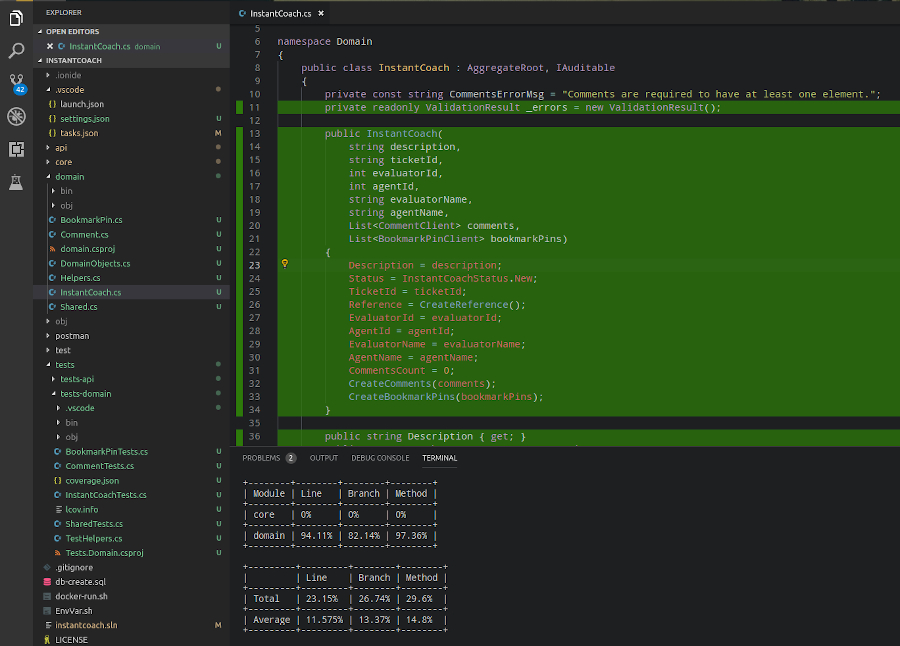

# InstantCoach API


[](https://travis-ci.org/xajler/instantcoach-api/builds)
[](https://coveralls.io/github/xajler/instantcoach-api?branch=master) [](https://app.codacy.com/app/xajler/instantcoach-api?utm_source=github.com&utm_medium=referral&utm_content=xajler/instantcoach-api&utm_campaign=Badge_Grade_Dashboard) [![Apiary API Docs](https://img.shields.io/badge/apiary-docs-blue.svg?logo=data:image/png;base64,iVBORw0KGgoAAAANSUhEUgAAABgAAAAYCAYAAAGXcA1uAAAABGdBTUEAALGPC/xhBQAAAYRpQ0NQSUNDIHByb2ZpbGUAACiRfZE9SMNAHMVfU6UilQ5WFHHIUF20ICriqFUoQoVQK7TqYHLpFzRpSFJcHAXXgoMfi1UHF2ddHVwFQfADxMXVSdFFSvxfUmgR68FxP97de9y9A4RaiWlWxzig6baZjMfEdGZVDLwigD70YxQhmVnGnCQl0HZ83cPH17soz2p/7s/Ro2YtBvhE4llmmDbxBvH0pm1w3icOs4KsEp8Tj5l0QeJHrisev3HOuyzwzLCZSs4Th4nFfAsrLcwKpkY8RRxRNZ3yhbTHKuctzlqpwhr35C8MZvWVZa7THEIci1iCBBEKKiiiBBtRWnVSLCRpP9bGP+j6JXIp5CqCkWMBZWiQXT/4H/zu1spNTnhJwRjQ+eI4H8NAYBeoVx3n+9hx6ieA/xm40pv+cg2Y+SS92tQiR0BoG7i4bmrKHnC5Aww8GbIpu5KfppDLAe9n9E0ZoPcW6F7zemvs4/QBSFFXiRvg4BAYyVP2ept3d7X29u+ZRn8/eDlyqa4xWvkAAAAJcEhZcwAADdcAAA3XAUIom3gAAAAHdElNRQfjBxUXLQpQdb41AAAE1klEQVRIx41Ub2iVZRT/nef9c/94391NN3QOUxREhIwKDUoCo6yWH9JwKBqpJREWCYKEpKzAD2l96kOFQporlT5kJlqoqWnimmQ5qIgia8rcH7fd3Xt33/d9nuecPmy7bXOL/T69z+Gc8zu/5/yeFxjCsm/2PkTbT5+XtqjjF/6TFxIArDn1ldCNGHiz9eS84VR66cvjUqoOCxW33QwAYPnOIwIAtP30eXGri+1FUwq6Y0beWhRZ5QkAXjx+vLngyJLeKyVU1QjcOncLDTdddaRJ8j8xptZ6OPr62sH4jpaPm4cT6i98fhQAaFfLqeZQFRfmNaPLMAZY5eeZdKD6erwl7W1OBgCiHp2r+QO1SVIZAoDnj30hhQTArQaV1YKDmxpIAYCTTAxT4OCmBgIABQCmOHBV5/rBOi4n0EdXr3q3va5rEfNUw6UgYsBH+76Wwp0d07z5/2imlIGTj1gQiuyi7afPSyQWoZhcdlpeIoEbW0a/BSJhxCxI9SRu1ihvQSpw4Noofs+y2WbFZNtvOoiEEYEx8CNLMimUzigkA7PABgLtEco3CAAbvj4poVhEMChejpAKHKQDhcOvPFfOczEWItD5PEQDwv6w/jJGnQ48VU/FtvYpBCkAADL4bmT3UXjj2olDO1v2PDI2/viZ/RfrLx6ZX77W3a2n1keW90Qs0BwGmnVp2uLwnitnS7tSiarXImEx4hZCkd7pnWqR29Phb51SHY6Q4KZuNU/pzCbTFAuX45XGsXPrMloJ04N3Ov3afL/TOu6sDDu7KzVjrk3fWxZt4xgDuXj57ZsqY23UXWa7DlX1m1spYUwiMnitNgwjQMpu6uhIzNEucqYlzKYCFwiGiKIYOZ++JQDYfOLEw9ra7yOy0J6DyFrYaxqpDCGZErhZKh5c25Apj7RvxYrLcyoqPMf3R41PSoESHoaT71rcZHCXNTiMYEolQBOA9F0F/zFcuMBxLgcbRcMDgeMYBrZn1JhjOzx7+NDOSPht/K6QuM9UHVu5sW/cgsa/zlVK78A2regFy+yKhIEVsa70nXUl3rp7yZa2kYVPXHp/porcd30/+4wVIcArGIE2LJ8kSnrvqfr1/QBAb/1wpslN6scMBJYFRgArApEwGPwGLAusCIhK7Xci8qAS1RaDMSuAAcsgwdBZACuMWZS67hZz7jrTp2AhLI69lMrqGihUjrcBLakZrgMyQ64aC8dSf92AH2Q9b6bnE5RPM0ZuTVlLj/Z2EmJrIeK0ZYNijjLJORPunEhUl+mp6PHqEi6CRNKv9dPOGFuIgI2BNQYWDBYGIGDBrO5cepbpExgIe370c0WlmhkXoQq/CrkFqvZ8gu87gZMY9AsbAxtZkACO8qA8F2rP8mUklmYD8hmACbSTimjK/bd7U9NzF50a5NxqUhN7PCTc6tZ66TtL69VdtmtsbFR/L35gM5P60CrAiMCAYcEwVhA1x3B9gpdQ8BIEzyc4PmDS9oMja1a/CiL+X18DQOO5c+6NqKQNeHIESULTxlXj9pr0WxZm2FIIYQNM4KJJvf1R/wGtoUshDA8aQBiAJYjRYG1hFcHzPADOhD3GVdC4bJk58OTTikvhOmFum1CVK1aneX/ThpUTMtBkpdZ/un82lLfXtDmL3Ky/+uTLDa2TqfsXYAOcbkx38XUAAAAASUVORK5CYII=)](https://instantcoachapi.docs.apiary.io)

[](https://sonarcloud.io/dashboard?id=xajler_instantcoach-api) [](https://sonarcloud.io/dashboard?id=xajler_instantcoach-api) [](https://sonarcloud.io/dashboard?id=xajler_instantcoach-api) [](https://sonarcloud.io/dashboard?id=xajler_instantcoach-api) [](https://sonarcloud.io/dashboard?id=xajler_instantcoach-api) [](https://sonarcloud.io/dashboard?id=xajler_instantcoach-api) [](https://sonarcloud.io/dashboard?id=xajler_instantcoach-api)

Using ASP.NET Core API for sample microservices REST API.


Unit testing with code coverage in VS Code



Domain Errors and Endpoint Request Logging


> Note:
>
> Most of C# files contain multiple classes, because of microservices nature, if this wouldn't be microservice, those would go to folders and separate files.

## Table of contents

*   [Dev Stack](#dev-stack)
*   [Features](#features)
*   [TODO for separate projects](#todo-for-separate-projects)
*   [API Documentation](#api-documentation)
*   [Run](#run)
    *   [Local Dev](#local-dev)
    *   [Docker Dev](#docker-dev)
    *   [Docker Test/Production](#docker-testproduction)
*   [Unit/Integration Testing](#unitintegration-testing)
    *   [All Tests](#all-tests)
    *   [Unit Tests](#unit-tests)
    *   [Integration Tests](#integration-tests)
    *   [Code Coverage Report](#code-coverage-report)
*   [Travis CI](#travis-ci)
*   [APM Server & LogStash](#apm-server--logstash)

## Dev Stack

*   Linux ([ArchLinux](https://archlinux.org))
*   .NET Core 2.2 (Local and [Docker](https://hub.docker.com/_/microsoft-dotnet-core-sdk))
*   C#7
*   [EF Core](https://docs.microsoft.com/en-us/ef/core/) (Commands) / ADO.NET via EF Core (Queries)
*   [Docker](https://www.docker.com/) and Docker Compose
*   [SQL Server 2017](https://www.microsoft.com/en-us/sql-server/sql-server-2017) [Linux, Docker]((https://hub.docker.com/_/microsoft-mssql-server))
*   [Nginx](https://nginx.org/en/) ([Docker](https://hub.docker.com/_/nginx))
*   [VS Code](https://code.visualstudio.com/) (With C# Extensions)
*   [Azure Data Studio](https://docs.microsoft.com/en-us/sql/azure-data-studio/what-is?view=sql-server-2017) (Local GUI for SQL Server)
*   Unit Testing ([xUnit](https://xunit.net/), [FluentAssertions](https://fluentassertions.com/),   [Coverlet](https://github.com/tonerdo/coverlet), [Moq](https://github.com/moq/moq4))
*   [ElasticSearch](https://www.elastic.co/products/elasticsearch), [Kibana](https://w  ww.elastic.co/products/kibana) and [APM](https://www.elastic.co/products/apm)
*   Logging with [Serilog](https://serilog.net/) with sinks to _Console_ and [ElasticSearch](https://github.com/serilog/serilog-sinks-elasticsearch).
*   Code quality with [SonarCloud](https://sonarcloud.io), [Codacy](https://codacy.com) and [Coveralls](https://coveralls.io).

## Features

*   [x] EF Migrations (Will update to last migration or create database in `Startup`)
*   [x] Config through `IOptions<T>`
*   [x] Linux MSSQL in Docker
*   [x] API Versioning (Dummy v2 inherited from v1, HTTP Header versioning `X-Api-Version`)
*   [x] REST API Endpoint (multiple versions, JWT Auth)
*   [x] Swagger (multiple versions, JWT Auth)
*   [x] Db CRUD / Service (to make Controller cleaner)
*   [x] JWT Auth
*   [x] Error Handling (Known Errors as `Result` and `Result<T>`, Global Exception through Middleware)
*   [x] Logging (`Serilog` console and sink to ElasticSearch)
*   [x] Request response time Middleware (including response time in logs and HTTP header as `  X-Response-Time`)
*   [x] Domain Models Validation
*   [x] Unit Testing (Domain)
*   [x] Refactoring (Domain to DDD and separate project)
*   [x] Integration Testing (Repositories and Controllers V1)
*   [x] Code Coverage ([coverlet](https://github.com/tonerdo/coverlet))
*   [x] Dockerfile Build/Publish/Run API
*   [x] Dockerfile Nginx web server with SSL nginx.conf (Not really necessary because this REST A  PI should be internal/private)
*   [x] Docker Compose (Development with watch, Test, CI Testing)
*   [x] SSL (local development: dotnet dev-certs https, test: nginx self-signed certificate)
*   [x] Github badges for Code Coverage [coveralls.io](https://coveralls.io/github/xajler/instantcoach-api) and CI [Travis CI](https://travis-ci.org/xajler/instantcoach-api) (master branch)
*   [x] Integrated Elasticsearch APM (Application Performance Monitoring)
*   [x] Integrated Elasticsearch LogStash through Kibana.
*   [ ] Unit Testing - Mock Services, problem Repository is not interface?
*   [ ] xUnit Categories for focused testing.
*   [ ] Redis cache Docker or Nginx
*   [ ] Health checks
*   [x] [Apiary docs created](https://instantcoachapi.docs.apiary.io) added badge to github r  epository
*   [ ] [Apiary](https://app.apiary.io) Tests
*   [x] Local and online ([SonarCloud](https://sonarcloud.io)) code analysis with [SonarScanner for MSBuild](https://docs.sonarqube.org/latest/analysis/scan/sonarscanner-for-msbuild/). Travis CI running it inside of Docker container.
*   [ ] Domain validation: Maybe use `FluentValidation` and send errors (merge with D  ataAnnotations ones) in Controller.
*   [ ] CD Azure (? only one I have access to deploy)
*   [ ] Check difference between Serilog [ElasticSearch Sink](https://github.com/serilog/serilog-sinks-elasticsearch) and [LogStash Sink](https://github.com/asukhodko/serilog-sinks-logstash-http)

## TODO for separate projects

*   GraphQL (? maybe separate project)
*   Message Queue (? maybe separate project)
*   CQRS (? maybe separate project)
*   Storyteller tests (?)

## API Documentation

[API Documentation](apiary.apib) is created with [API Blueprint](https://github.com/apiaryio/api-blueprint/blob/master/API%20Blueprint%20Specification.md) specification.

Documentation also includes examples and console to try and run mocked examples data.

[](https://instantcoachapi.docs.apiary.io)

## Run

Scripts created are compatible with _Unix_ like operating systems (_Linux_, _BSD_, _macOS_). It won't work on _Windows_, but it should be easy to use command in there to run in _Windows_.

Make sure that Docker is installed and service is running, on most Linux machines it is achievable with `systemd` command:

```ssh
sudo systemctl start docker.service
# or you can enable it, so it will be started when OS is booted
sudo systemctl enable docker.service
```

For other operating systems do according way of starting/enabling docker service.

### Local Dev

Runs with locally installed _.NET Core SDK_. Uses only _MSSQL_ as a _Docker_ container.

Find out more how to run [Local Dev](_docs/local-dev-env.md).

Short version:

```shell
docker pull microsoft/mssql-server-linux
./docker-mssql-run.sh
dotnet dev-certs https -ep ${HOME}/.aspnet/https/instant-coach-api.pfx -p bm8kpv@=n2y4Nz@#
./run-local.sh
```

### Docker Dev

Runs all services as _docker_ containers, but with mounted _docker volumes_ to code repository and _https certificate_. Has `ASPNETCORE_ENVIRONMENT` set to `Development`, and uses _APM Server_ with _ElasticSearch LogStash_ as main development driver

Find out more how to run [Docker Dev](_docs/docker-dev-env.md).

Short version:

```shell
./run-dev-docker.sh
```

### Docker Test/Production

Similar to [Docker Dev](_docs/docker-dev-env.md) but not sharing local machine folder(s) as docker container volumes. Everything runs inside of docker containers.

TODO: More to add.

## Unit/Integration Testing

Make sure _MSSQL_ runs for Integration tests.

### All Tests

Best to run script:

```shell
# Change DB_HOST, if your DB host different than localhost
DB_HOST=localhost ./run-code-coverage.sh
```

Runs all tests and at the end generates code coverage report, more info in [Code Coverage Report](#code-coverage-report) section.

### Unit Tests

Best to run test with watcher, so any time file is saved it will restart all unit tests.

```shell
cd tests/tests-unit
dotnet watch test
```

It can show code coverage when all tests ran successfully with this command:

```shell
dotnet watch test /p:CollectCoverage=true /p:CoverletOutputFormat=cobertura /p:CoverletOutput=./coverage.xml
```

### Integration Tests

For Integration tests it is not recommended to use `dotnet watch`.

```shell
cd tests/tests-integration
# Change DB_HOST, if your DB host different than localhost
DB_HOST=localhost dotnet test
```

It can show code coverage when all tests ran successfully with this command:

```shell
DB_HOST=localhost
dotnet watch test /p:CollectCoverage=true /p:CoverletOutputFormat=cobertura /p:CoverletOutput=./coverage.xml
```

### Code Coverage Report

Run all tests with _coverlet_ (Make sure MSSQL docker container is created)

```ssh
# Change DB_HOST, if your DB host different than localhost
DB_HOST=localhost ./run-code-coverage.sh
```

On test runs success _coverlet_ wil generate _coverage.xml_ in test folders and _Report Generator_ will merge code coverages and create coverage report in folder `_coveragereport`.
To see coverage report open `_coveragereport/index.htm` in your favourite browser.

## Travis CI

CI testing is done entirely in docker, because _Travis CI_ is currently not supports _.NET Core 2.2_had. When tests are ran successfully generated code coverage will be sent to [coveralls.io](https://coveralls.io/github/xajler/instantcoach-api) service.

There are two ways to do CI Testing depending on branch:

* `master`: Docker compose on up it will start all tests (Unit and Integration).
* `dev` (or any other): `Dockerfile` that on run will start only Unit tests.

## APM Server & LogStash

[Docker Dev](_docs/docker-dev-env.md) and Test Environment can use _Elasticsearch APM (Application Performance Monitor) Server_ for monitoring errors and requests and system metrics. At this point in time _.NET Core Agent for APM Server_ is not production ready, but it is of great value for developers. It can be great for stress testing with _jMeter_ or _Postman_ runner.

Logs are sent via `Serilog` sink to ElasticSearch LogStash and can be queried in _Kibana_.

For more information look into [docs for APM and LogStash](_docs/apm-logstash.md).

Short version open _Kibana_ and use _APM_ and _Discover_ modules:

    http://localhost:5601

APM Transactions


APM Metrics


LogStash Query

